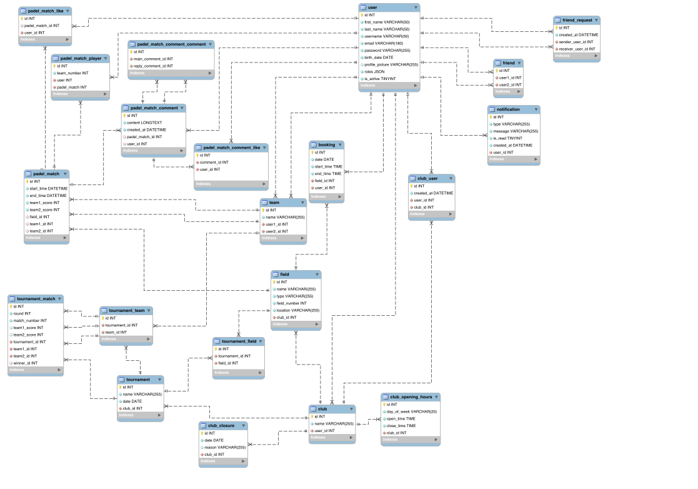

# CourtConnect (SEWT) Project Repository
CourtConnect is a padel sports platform built with Symfony (PHP) and powered by a Doctrine/MySQL backend.
## Table of Contents
- [Project URL](#project-url)
- [Website Credentials](#website-credentials)
- [Features](#features)
  - [Authentication](#authentication)
  - [Club Management](#club-management)
  - [Field Booking](#field-booking)
  - [Social Functionality](#social-functionality)
  - [Tournaments](#tournaments)
- [Technologies](#technologies)
- [Code Coverage](#code-coverage)
- [ERD Diagram](#erd-diagram)
## Project URL
Provide a link to the main page of your application. Or if you have multiple parts in your website you can provide a list of links.

* [Main application](https://a25sewt102.studev.groept.be/public)
* [Admin version](https://a25sewt102.studev.groept.be/public)

-> Owners of a club needs to contact us for getting the permissions (so that we can verify the club)

---

## Website credentials

### Regular user
- login : user@demo.com
- password : UserPassword102@

### Admin
- login : admin@demo.com
- password : AdminPassword102@

---

## Features
### Authentication
* Users can create an account with a unique username and email address (availability is validated in real time). 
* Strong passwords are enforced using Symfony’s PasswordStrength validator. 
* Users can securely log in using their email and password.
### Club Management
Users can join clubs, while club owners are assigned a dedicated admin role. This role gives some extra features in the fields and tournaments management (see further):
* Manage courts
* Set opening hours
* Define closure dates
* Organize tournaments for their members
### Field Booking
Players can book padel courts at their clubs by filtering on date, time & duration
The booking system automatically respects each club’s opening hours and scheduled closures.
### Social Functionality
CourtConnect includes a social layer where users can:
* Users can change their profile settings (username, firstname, profile picture, ...)
* Send and manage friend requests
* Create teams with your friends
* View matches played by their friends on the homepage
* See match details such as scores, players, and court
* Like and comment on matches on their feed
### Tournaments
The platform supports competitive play through a tournament system:
* Clubs can organize team-based competitions
* Teams can register for tournaments
* Watch the score at the end of a tournament
## Technologies
* Framework: Symfony 6/7 (PHP)
* Frontend: Twig
* Database: Doctrine ORM with MySQL
* CI/CD: GitLab CI pipeline
* Testing: PHPUnit

## Code Coverage
https://a25sewt102.studev.groept.be/coverage/index.html
## ERD Diagram

